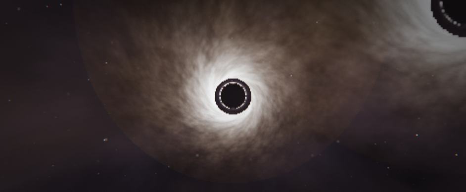
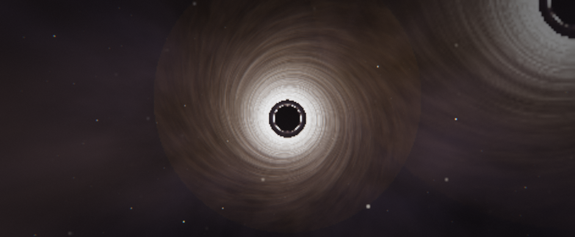
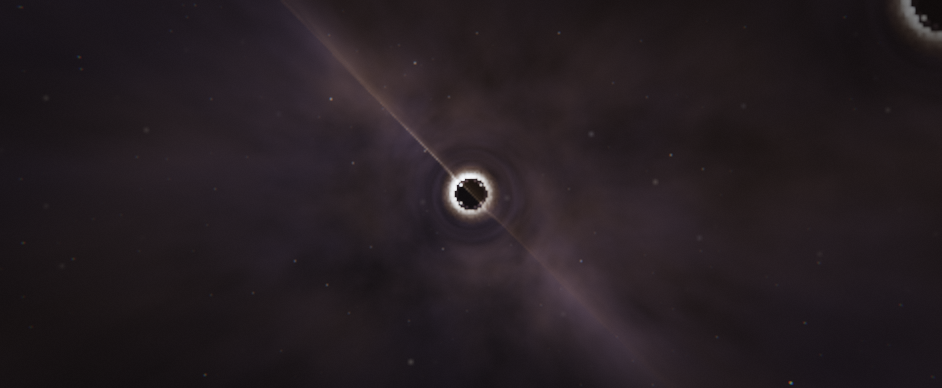
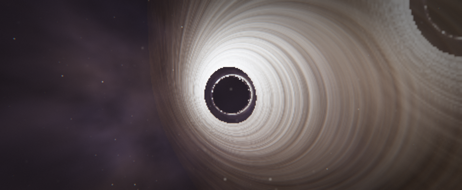
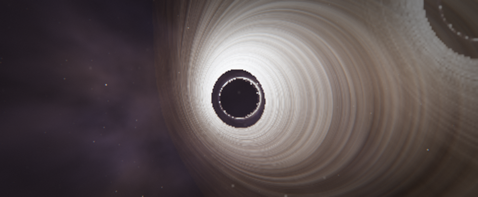

# GARGANTUA — Schwarzschild Black Hole Raytracer

A full-screen, real-time black hole renderer built from scratch with native
HTML/CSS/JavaScript, ES Modules and **local Three.js** (no build step, no CDN,
no textures, no videos, no screenshots). The image is produced by a full-screen
fragment shader that **integrates exact Schwarzschild null geodesics on the GPU**
for every pixel.

> Physics: units `2M = 1` (Schwarzschild radius = 1, photon sphere = 1.5,
> ISCO = 3). The geodesic is integrated with the exact Binet-consistent ODE
> `x'' = −(3/2)·|x×v|² / r⁵ · x` (equivalent to `u'' + u = 3u²/2`), with adaptive
> step refinement near the photon sphere. Everything you see is emergent from
> that integration: the event-horizon shadow, the photon ring, gravitational
> lensing of the disk and starfield, multiple disk-plane crossings, relativistic
> Doppler beaming, and gravitational redshift.

## Screenshots

Real captures from the raytracer (see `screenshots/`):

| Classic (High) | Edge-on | Overhead | Close-up | Cinematic |
|---|---|---|---|---|
|  |  |  |  |  |

---

## Run it

Any static server works (the page is plain ES modules + a local import map):

```bash
cd GARGANTUA

# option A — bundled zero-dependency server (also provides the screenshot API)
node server.js 8080

# option B — Python
python -m http.server 8080

# option C — Node one-liner / any static file server
npx serve
```

Then open **http://localhost:8080/**.

No build step, no package install, fully offline once the folder is copied.

---

## Features

- **Real physics in a fragment shader** — exact Schwarzschild null geodesics,
  event horizon (r=1), photon sphere (r=1.5), ISCO (r=3), capture shadow.
- **Accretion disk** — Keplerian thin disk (3.2…22 in 2M units), Shakura–Sunyaev
  temperature profile, blackbody colour, relativistic Doppler beaming
  (approaching side brighter/bluer), gravitational redshift, multiple
  crossings (rays pass through the thin disk and accumulate emission, giving
  the lensed "fishtail" far-side image above/below the hole), animated
  differentially-shearing turbulence (co-rotating fBm noise).
- **Procedural sky** — star layers with magnitude distribution, galactic plane
  with spiral arms, nebula glow, gravitational-lens magnification boost near
  the photon sphere, twinkle.
- **Post pipeline (HDR)** — half-float render targets, Kawase dual-filter bloom
  (luminance-based bright extraction), ACES filmic tonemap, vignette, film
  grain, subtle chromatic aberration, pure-black horizon.
- **Interactivity** — OrbitControls (orbit/zoom/pan), 4 view presets with
  eased flights, cinematic camera loop, HUD, 21 live parameters, 0–9 debug
  views, keyboard shortcuts, optional procedural ambient music (WebAudio, no
  assets), pause, screenshots.
- **Robustness** — Standard / High / Cinematic quality tiers, Retina-aware
  scaling, mobile layout (panel becomes a bottom sheet), localStorage state
  persistence, WebGL context-loss recovery, URL automation for screenshots.

---

## Controls

| Input | Action |
|---|---|
| Drag | Orbit camera |
| Wheel / pinch | Zoom |
| Right-drag | Pan |
| `0` – `9` | Debug views (0 = final image) |
| `Space` | Toggle cinematic camera loop |
| `F1` – `F4` | Presets: Classic / Overhead / Edge-on / Close-up |
| `M` | Toggle ambient music |
| `H` | Toggle HUD |
| `P` | Pause / resume rendering |
| `Q` | Cycle quality (Standard → High → Cinematic) |
| `S` | Save PNG screenshot |
| `R` | Reset all parameters |
| `` ` `` | Toggle control panel |
| `?` | Help overlay |
| `Esc` | Close help / panel |

---

## Debug views (0–9)

| Key | View |
|---|---|
| 0 | Final image |
| 1 | Integration steps (heat) |
| 2 | Hit type (horizon / disk / sky) |
| 3 | Disk-plane crossings count |
| 4 | Doppler shift at emission (red/blue) |
| 5 | Radius at end of ray (log heat) |
| 6 | Closest approach to the hole (log heat) |
| 7 | Raw HDR raytracer output (no post) |
| 8 | Bloom only |
| 9 | Test card (tonemap ramp + bars + grid) |

---

## The 21 parameters

| Group | Param | Default | Range | Meaning |
|---|---|---|---|---|
| Camera | `fov` | 60° | 30–100 | Vertical field of view |
| Physics | `stepScale` | 0.02 | 0.005–0.08 | Integration step factor (quality multiplies it) |
| Disk | `diskInner` | 3.2 | 2.5–8 | Disk inner edge (units of 2M; ISCO = 3) |
| Disk | `diskOuter` | 22 | 8–60 | Disk outer edge |
| Disk | `diskTemp` | 9000 K | 3000–20000 | Peak disk temperature |
| Disk | `tempExp` | 0.75 | 0.25–1.5 | T ∝ r⁻ᵉˣᵖ falloff |
| Disk | `turbulence` | 0.3 | 0–0.6 | Disk turbulence amplitude |
| Disk | `turbSpeed` | 0.5 | 0–1 | Turbulence animation speed |
| Disk | `doppler` | 1 | 0–1 | Relativistic beaming strength |
| Disk | `redshift` | 1 | 0–1 | Gravitational redshift strength |
| Disk | `emission` | 1.1 | 0.1–5 | Disk HDR emission scale |
| Disk | `diskOpacity` | 0.94 | 0.5–1 | Per-crossing transmission |
| Sky | `starDensity` | 0.8 | 0–2 | Star density |
| Sky | `galaxy` | 1.0 | 0–2 | Galaxy / nebula intensity |
| Sky | `galaxyTwist` | 1.2 | 0–3 | Spiral-arm twist |
| Post | `exposure` | 1.0 | 0.1–4 | Exposure (before ACES) |
| Post | `bloom` | 0.6 | 0–3 | Bloom intensity |
| Post | `bloomThresh` | 1.0 | 0–2 | Bloom bright threshold |
| Post | `vignette` | 0.45 | 0–1 | Vignette strength |
| Post | `grain` | 0.12 | 0–1 | Film grain amount |
| Post | `chromatic` | 0.25 | 0–1 | Chromatic aberration |

Double-click a slider label to reset that parameter to its default.

---

## Quality tiers

| Tier | Steps/ray | Step mul | Render scale (of Retina res) | Bloom octaves |
|---|---|---|---|---|
| Standard | 500 | 1.2 | 0.5 | 3 |
| High | 1000 | 1.0 | 0.75 | 4 |
| Cinematic | 1600 | 0.8 | 1.0 | 5 |

Standard is auto-selected on mobile / coarse-pointer devices. Retina device
pixel ratio is capped at 2×; internal render scale then applies on top.

---

## State persistence & URL automation

All settings are saved to `localStorage` (`gargantua.v1`) and restored on load.
Append `?reset=1` to clear them.

Any of the 21 parameters can be overridden from the URL:

```
http://localhost:8080/?diskTemp=14000&turbulence=0.5&exposure=1.4&quality=cinematic&preset=overhead
```

Special parameters: `quality` (standard|high|cinematic), `preset`
(classic|overhead|edge|close), `debug` (0–9), `scale` (0.25–2 internal
resolution multiplier), `cinematic` (0/1), `music` (0/1), `shot`, `series`,
`shot_url`, `log_url`, `close`, `logcam`, `reset`.

**Screenshot automation**

- `?shot=1` — capture one PNG after the scene settles.
- `?shot=1&shot_url=http://host:port/shot` — POST the PNG (JSON
  `{ png: "data:image/png;base64,…", name?, quality?, params? }`) to your
  endpoint. The bundled `node server.js` saves these to `./shots/`.
- `?series=1&shot_url=…` — capture a full series (all debug views, all
  presets, all qualities) — used for automated acceptance testing.
- `?log_url=…` — POST collected JS errors/warnings for CI checks.
- `&close=1` — `window.close()` after the automation finishes (headless use).
- `&logcam=1` — log the camera pose periodically (debugging).

Browser API: `window.GARGANTUA` exposes `capture()`, `setParam(id, v)`,
`getParams()`, `setQuality(q)`, `setDebug(n)`, `setPreset(id)`,
`setCinematic(b)`, `reset()`, and the `state` object.

---

## Project layout

```
GARGANTUA/
├── index.html              # shell + import map
├── css/style.css           # HUD, panel, overlay, responsive
├── js/
│   ├── main.js             # renderer, passes, loop, errors, URL automation
│   ├── config.js           # 21 params, quality & view presets, debug list
│   ├── shaders.js          # all GLSL (raytracer, bloom, final composite)
│   ├── state.js            # params store, localStorage, URL parsing
│   ├── camera.js           # cinematic path + preset flight
│   ├── audio.js            # procedural WebAudio ambient music
│   └── ui.js               # control panel, HUD, shortcuts, help
├── vendor/three/           # local Three.js r160 (+ OrbitControls)
├── server.js               # optional zero-dep static server + /shot /log
├── tools/
│   ├── raytest.html        # standalone shader test harness (dev)
│   ├── analyze_png.py      # dependency-free PNG analyzer (dev)
│   └── ascii_viz.py        # coarse ASCII visualization (dev)
└── shots/                  # screenshot receiver output
```

---

## Implementation notes

- **Passes per frame**: raytracer → HDR colour RT (RGBA16F) → (aux RT while a
  debug view is active) → bloom down/up chain → final composite to the canvas.
- **No textures anywhere** — the disk, stars, galaxy, nebula and grain are all
  generated analytically in the shader.
- **WebGL2 / GLSL ES 3.0** required (half-float render targets). On context
  loss the page shows a recovery overlay and re-initialises automatically.
- **Screenshot capability** uses `preserveDrawingBuffer: true` so
  `canvas.toDataURL()` works any time.

## Known limitations

- The photon ring sharpness is bounded by the step budget; use Cinematic for
  the crispest ring.
- On very weak GPUs High/Cinematic may drop below 60 fps — reduce `scale` via
  URL or use Standard.
- Disk turbulence is pseudo-physical (shearing fBm in the co-rotating frame),
  not magnetohydrodynamics.
